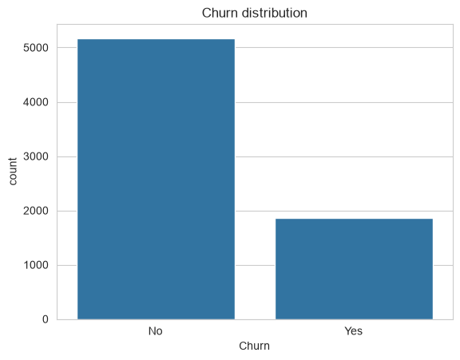
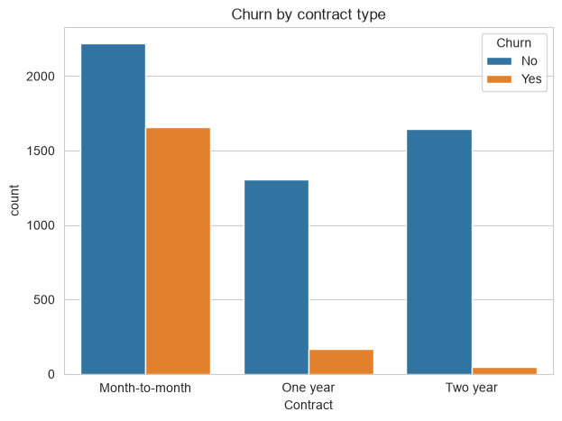
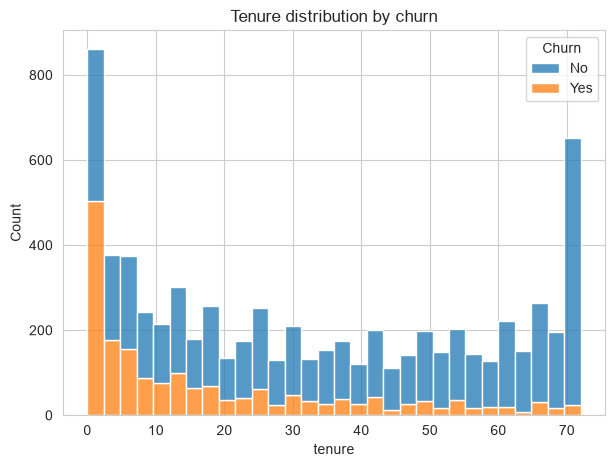
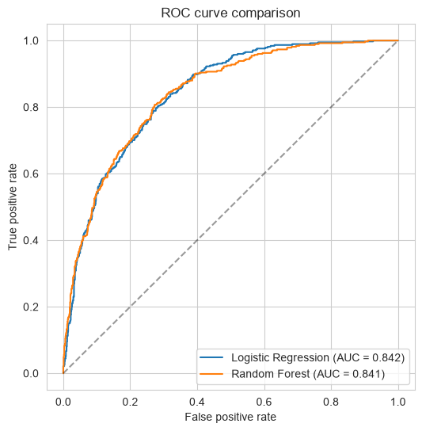
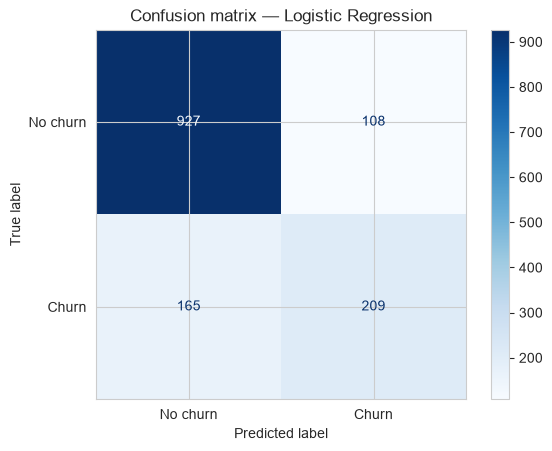
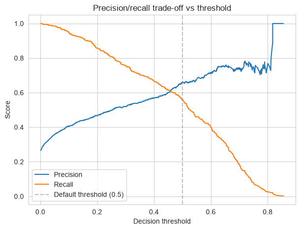
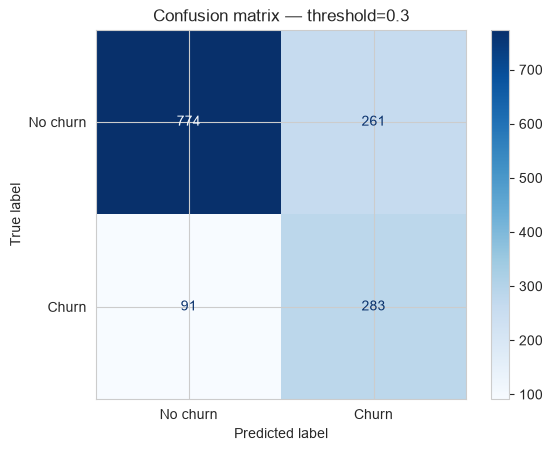
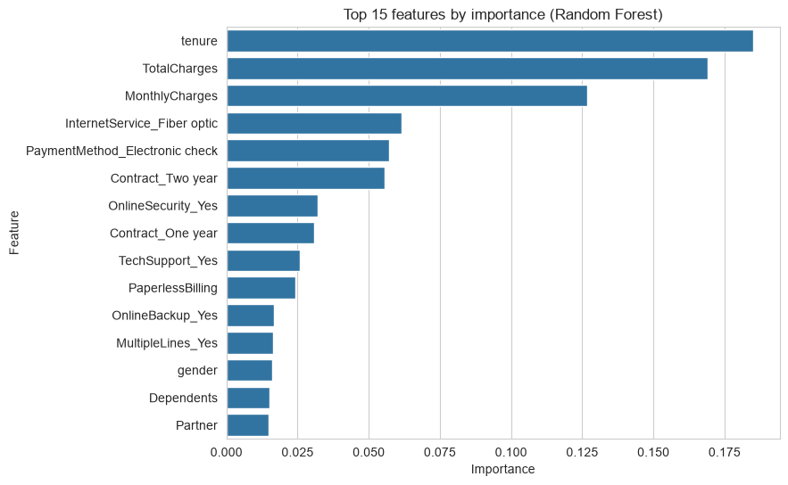

# Customer Churn Prediction

Predicting which telecom customers are likely to cancel their subscription, using the IBM Telco Customer Churn dataset.

## Problem Statement

Customer churn is expensive, getting a new customer usually costs a lot more than keeping an existing one. If a company can spot which customers are at risk of leaving before they leave, they can target retention offers at the people who actually need convincing instead of wasting money on customers who were never going to leave anyway.

This project builds a model that predicts churn from a customer's account info, contract type and services.

## Objectives

- Explore the dataset and figure out what actually drives churn
- Clean and prep the data for modeling
- Train a baseline model and compare it to a more complex one
- Evaluate properly since churn is an imbalanced outcome
- Try to improve recall since catching more churners is the main goal
- Figure out which features matter most

## Dataset

[IBM Telco Customer Churn](https://github.com/IBM/telco-customer-churn-on-icp4d), 7043 customers, 21 columns covering demographics, account details (tenure, contract, payment method), services subscribed (phone, internet, streaming, tech support), billing, and whether the customer churned.

## Technologies Used

Python, pandas, NumPy, matplotlib, seaborn, scikit-learn

## Project Structure

```
customer-churn-prediction/
├── README.md
├── data/
│   └── Telco-Customer-Churn.csv
├── notebooks/
│   └── churn_prediction.ipynb
├── results/
│   └── charts exported from the notebook
├── requirements.txt
└── .gitignore
```

## Data Cleaning

TotalCharges was stored as text instead of a number. Turns out the blank values all belonged to customers with tenure = 0, basically brand new customers who hadnt been billed yet, so those got filled with 0 instead of dropped.

## Exploratory Data Analysis

- About 27% of customers churned. Imbalanced target, matters for how the models get evaluated later.
- Contract type is one of the strongest signals, month to month customers churn way more than customers on a 1 or 2 year contract. Makes sense since theres no penalty for leaving.
- Tenure: churn is heavily concentrated in the first several months. Customers who stick around past year one are a lot less likely to leave.
- TotalCharges is highly correlated with tenure (roughly tenure x MonthlyCharges), so it doesnt add a ton of independent signal but I kept it anyway.

| Churn distribution | Churn by contract type | Tenure by churn |
|---|---|---|
|  |  |  |

## Feature Engineering

- Binary Yes/No columns (Partner, Dependents, PaperlessBilling, etc) got label encoded.
- Columns with more than 2 categories (Contract, InternetService, PaymentMethod, etc) got one-hot encoded instead, so the model doesnt accidentally think one category is bigger than another.
- Numeric columns (tenure, MonthlyCharges, TotalCharges) were standardized before Logistic Regression. Without scaling the solver actually failed to converge, since these columns are way bigger numbers than the 0/1 dummy columns.

## Methodology

80/20 train test split, stratified on churn so both sets have the same class balance.

## Models Used

- **Logistic Regression**, the baseline. Simple, fast, interpretable, gives something for a fancier model to actually beat.
- **Random Forest**, tried next to see if it picks up on non linear relationships that Logistic Regression cant.

## Model Evaluation

Accuracy alone is kind of misleading here since a model that just predicts "No churn" every time would already be about 73% accurate without being useful at all. Precision, recall and ROC-AUC give a better picture.

| Model | Accuracy | Precision (Churn) | Recall (Churn) | F1 (Churn) | ROC-AUC |
|---|---|---|---|---|---|
| Logistic Regression | 0.81 | 0.66 | 0.56 | 0.60 | **0.842** |
| Random Forest | 0.81 | 0.67 | 0.53 | 0.59 | 0.841 |





## Results

Both baseline models perform pretty much the same. Random Forest doesnt seem to be picking up much extra signal, probably because the strongest churn features (contract type, tenure) are already close to linearly related to the outcome. Going with Logistic Regression since it performs the same and is way easier to explain.

## Improving Recall

The baseline only catches 56% of actual churners, which isnt great for a retention use case where missing a churner is usually worse than wasting an offer on someone who wasnt going to leave. Two things were tried:

| Approach | Precision (Churn) | Recall (Churn) | ROC-AUC |
|---|---|---|---|
| Baseline (threshold 0.5) | 0.66 | 0.56 | 0.842 |
| class_weight="balanced" | 0.50 | **0.78** | 0.842 |
| Threshold tuned to 0.3 | 0.52 | 0.76 | 0.842 |



class_weight="balanced" ended up being the better fix, recall goes from 0.56 to 0.78 (catching around 3 in 4 churners now instead of just over half), precision drops to 0.50 though. ROC-AUC barely changes either way, which makes sense since it measures how well the model ranks churners above non churners and neither technique changes that ranking, they just move where the cutoff sits. Threshold tuning got a similar but slightly worse result (0.76 recall) so class weighting is the one id actually go with.



## Key Findings



tenure, TotalCharges, MonthlyCharges and Contract type are consistently the strongest predictors. Highest risk group is new customers on month to month contracts paying high monthly charges, which points to a pretty simple retention strategy: try to get customers onto longer contracts, and pay more attention to customers in their first few months.

## Limitations

- Precision drops to 0.50 in the recall-improved model, so about half the customers flagged as "at risk" wont actually churn. Retention offers under this model would go to a lot of people who didnt need one.
- Its a snapshot, not a time series, so it cant say when a customer is about to churn, just that they're at higher risk.
- Didn't do much hyperparameter tuning, max_depth=10 for Random Forest was just a reasonable guess.
- Didn't try SMOTE, only class weighting and threshold tuning, which was already enough to see a clear improvement.

## Future Improvements

- Try SMOTE and compare it against class weighting
- Proper hyperparameter tuning with GridSearchCV
- Try XGBoost or LightGBM as a stronger comparison model
- Pick the threshold based on an actual cost estimate instead of a round number like 0.3

## How to Run the Project

```bash
git clone https://github.com/amirajsingh6/customer-churn-prediction.git
cd customer-churn-prediction

python -m venv .venv
source .venv/bin/activate   # Windows: .venv\Scripts\activate

pip install -r requirements.txt
jupyter notebook notebooks/churn_prediction.ipynb
```
